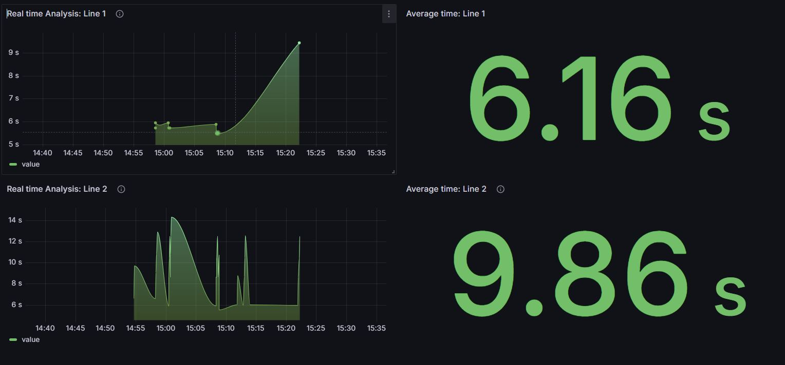
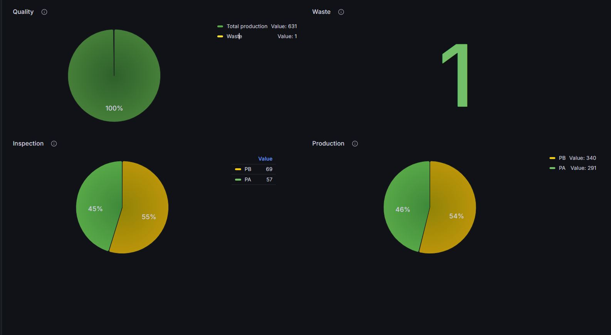

# Design and Configuration of Automated Production Systems using Virtual Environments

<table style="width:100%">
  <tr>
    <td align="center">
      
    </td>
  </tr>
</table>

 
## Getting Started
The primary goal of this project is to model an industrial plant and simulate its behavior using advanced virtual environments. This endeavor seeks to enhance the design, configuration, and optimization processes for automated production systems. Formally, it's a course of University of Applied Sciences of Southern Switzerland.

## Requirements
To bring this project to life, you'll need the following tools and technologies:

* **Java JDK 11**: Our model runs on JDK11 [download](https://www.oracle.com/java/technologies/javase/jdk11-archive-downloads.html). Ensure you have it installed.
* **DDDModelEditor**: For the modeling part [download].
* **InfluxDB 2.7.6**: All data is stored efficiently for time series data: [download](https://portal.influxdata.com/downloads/).
* **Grafana v.11**: To visualize sensor measurements, we use [download](https://grafana.com/grafana/download).
* **Fusion360**:To create custom items and put them into production. [download](https://www.autodesk.ch/it/products/fusion-360/overview?term=1-YEAR&tab=subscription).

With these tools in your toolkit, you'll be well-equipped to dive into the world of automated production systems.

### Sidenote for Windows
* **DDDModelEditor**: [Windows](https://drive.switch.ch/index.php/s/uaz6sIOhuMdvfLt)

### Sidenote for Apple Silicon macOS users
* **DDDModelEditor**: [MacOs](https://drive.switch.ch/index.php/s/9Qi5fRmON4E24ZD)

## Examples of KPIs with Grafana

<table style="width:100%">
  <tr>
    <td align="center">
      
    </td>
  </tr>
  <tr>
    <td>
       
    </td>
  </tr>
</table>

 
## List of Authors:

 - *[Davide Preatoni](https://github.com/)*
 - *[Simone Bedendi](https://github.com/)*
 
 
